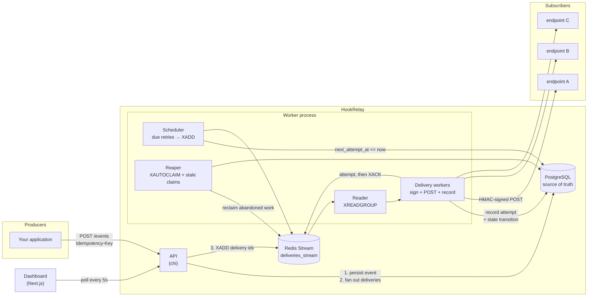
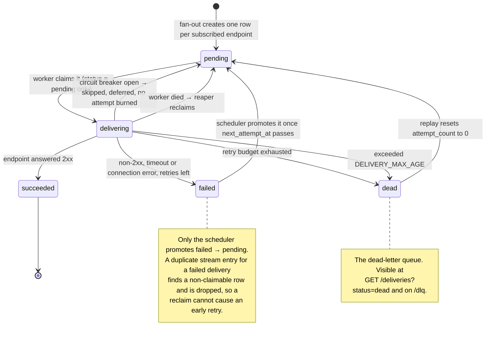

# HookRelay

Reliable webhook delivery as a standalone service. Producers publish events to
HookRelay; HookRelay guarantees they reach every subscribed endpoint — signed
with HMAC, retried with exponential backoff for hours, and parked in a
dead-letter queue you can inspect and replay if an endpoint never comes back.

**The promise: at-least-once delivery, never silent loss.**

Verified against a real stack: 10,000 events fanned out to 30,000 deliveries
with **zero lost**, including a hard `SIGKILL` of the worker mid-flight.

```
┌── Producer ──┐        ┌──────── HookRelay ────────┐        ┌── Subscribers ──┐
│ POST /events │ ─────► │ persist → fan out → queue │ ─────► │ signed POST     │
└──────────────┘        │      delivery workers     │        │ 2xx = delivered │
                        └───────────────────────────┘        └─────────────────┘
```

---

## Contents

- [How it works](#how-it-works)
- [Quick start](#quick-start)
- [Architecture](#architecture)
- [Delivery state machine](#delivery-state-machine)
- [Retry schedule](#retry-schedule)
- [Verifying signatures (for subscribers)](#verifying-signatures-for-subscribers)
- [API reference](#api-reference)
- [Dashboard](#dashboard)
- [Configuration](#configuration)
- [Testing](#testing)
- [Load and chaos test results](#load-and-chaos-test-results)
- [Repository layout](#repository-layout)
- [Further reading](#further-reading)

---

## How it works

A walkthrough of one event's whole life, in plain language. Nothing here assumes
you have read the code.

### The cast

- **A tenant** is a customer of HookRelay — your application. It gets one API
  key for publishing and an email/password for the dashboard.
- **An endpoint** is a URL a tenant registered, plus the list of event types it
  wants. Each endpoint has its own `whsec_` signing secret.
- **An event** is something that happened: `order.created`, with a JSON payload.
  Immutable once published.
- **A delivery** is one event's journey to *one* endpoint. If three endpoints
  subscribe to `order.created`, publishing one event creates three deliveries.
  Each retries independently — one endpoint being down does not affect the
  others.
- **An attempt** is a single HTTP request. A delivery may have up to eight.

The distinction between *event*, *delivery* and *attempt* is the thing to hold
onto. An event is what happened; a delivery is a promise to one subscriber; an
attempt is one try at keeping that promise.

### Step 1 — you publish an event

```bash
curl -X POST localhost:8080/events \
  -H "Authorization: Bearer $KEY" \
  -H "Idempotency-Key: order-1234-created" \
  -d '{"event_type":"order.created","payload":{"order_id":"ord_1234"}}'
```

HookRelay validates it, then does four things in one database transaction:

1. Writes the **event** row (with a ULID for an id, so ids sort by time).
2. Looks up every **active endpoint** subscribed to `order.created`.
3. Writes one **delivery** row per endpoint, all in state `pending`.
4. Commits.

Only *after* that commit does it push the delivery IDs onto the Redis queue and
return `202 Accepted`.

That ordering is the single most important thing in the system. Everything is
durable in Postgres before Redis is told anything exists. If the process is
killed between the commit and the queue push, the deliveries are already sitting
in the database marked `pending` — and the scheduler (step 5) will find them. The
queue makes delivery *fast*; the database is what makes it *reliable*.

If you sent an `Idempotency-Key` you already used, HookRelay returns the original
event with `"duplicate": true` and creates nothing. Retrying a publish because
your own network hiccuped can never double-send.

### Step 2 — a worker picks the delivery up

The worker process reads delivery IDs off the Redis stream. Notice what the
stream carries: **just the ID**. Not the payload, not the URL, not the secret.
The worker takes that ID and loads the current state from Postgres.

This is why losing Redis costs you nothing permanent, and why a retry always
uses the *latest* endpoint configuration — change the URL or rotate the secret
and in-flight retries pick it up immediately.

Before doing any work, the worker tries to **claim** the delivery:

```sql
UPDATE deliveries SET status = 'delivering'
WHERE id = $1 AND status = 'pending'
```

If that returns no row, someone else already has it, or it already succeeded, or
it is currently waiting out a retry delay. The worker acknowledges the queue
entry and drops it. This one conditional update is what makes duplicate queue
entries harmless instead of dangerous.

### Step 3 — the request is signed and sent

The worker builds a canonical JSON body:

```json
{"id":"01J8Z...","event_type":"order.created","timestamp":1750000000,"data":{"order_id":"ord_1234"}}
```

then computes `HMAC-SHA256` over the exact string `{id}.{timestamp}.{body}` using
the endpoint's secret, and POSTs with a 10-second timeout:

```
X-HookRelay-Id:        01J8Z...
X-HookRelay-Timestamp: 1750000000
X-HookRelay-Signature: v1=3f2a9c...
X-HookRelay-Attempt:   1
```

Your subscriber recomputes that HMAC with its copy of the secret. If it matches,
the request genuinely came from HookRelay and has not been altered.

Why sign the id and timestamp too, rather than just the body? Because a
signature over the body alone is valid *forever*. Anyone who captures one
legitimate request could replay it verbatim next year and the receiver would have
no way to object. With the timestamp inside the signature, the receiver rejects
anything older than a few minutes — and it cannot be forged, because changing the
timestamp breaks the signature.

**2xx means delivered.** Anything else — a 500, a timeout, a refused
connection — is a failure.

### Step 4 — the outcome is recorded, then acknowledged

In one transaction the worker writes an **attempt** row (status code, latency,
error text) and moves the delivery to its next state:

- **2xx** → `succeeded`. Done.
- **Failure, retries left** → `failed`, with `next_attempt_at` set to now plus
  the next backoff delay.
- **Failure, retries exhausted** → `dead`. It is now in the dead-letter queue.

Only after that transaction commits does the worker send `XACK` to Redis.

That order is deliberate and it is what the whole reliability claim rests on. An
unacknowledged queue entry therefore *always* means "an attempt whose result was
never recorded". If the worker is killed at any point before the `XACK`, Redis
still holds the entry in its pending list, and it gets picked up again. If we
acknowledged first and recorded second, a crash in between would lose the
delivery with no trace of it anywhere.

### Step 5 — failures come back later

A `failed` delivery is not in the queue any more; it is just a database row with
a future `next_attempt_at`. The **scheduler** runs once a second, finds rows whose
time has come, and puts them back on the queue.

The delays are `5s → 30s → 2m → 10m → 30m → 2h → 5h`, each with ±20% random
jitter, giving a total window of about eight hours. The delays are shaped around
how real outages resolve: seconds for a dropped connection, minutes for a
deploy, hours for an incident someone has been paged about. The jitter matters
because a hundred deliveries that failed together would otherwise all retry at
the same instant and hit the recovering endpoint as one spike.

The scheduler has one subtlety worth knowing. When it promotes a delivery it
pushes `next_attempt_at` 60 seconds into the future rather than clearing it. If
the queue push then fails, the row simply becomes due again a minute later. Had
it cleared the timestamp, a failed push would leave a row that no query ever
selects again — committed, visible as "pending" forever, and never delivered.
Silent loss, which is the exact thing this system exists to prevent.

### Step 6 — if the endpoint stays broken

Two protections kick in.

**The circuit breaker.** After 20 consecutive failures an endpoint is paused for
five minutes. Its deliveries are recorded as `skipped` and deferred without
burning a retry.

This protects *HookRelay*, not your subscriber. Without it, one hard-down
endpoint with 10,000 queued deliveries would occupy every worker for the full
10-second timeout, over and over, while healthy endpoints waited behind it. In
the load test the breaker turned roughly 30,000 would-be timeouts into cheap
skips — it is the reason the run finished at all.

**The absolute deadline.** Because a skip does not consume a retry, a delivery
for an endpoint that never recovers would otherwise be deferred forever and never
die. `DELIVERY_MAX_AGE` (24 hours by default) is the backstop that guarantees
every delivery eventually reaches a terminal state.

### Step 7 — the dead-letter queue and replay

A delivery that used all eight attempts is `dead`. It is not gone: it is sitting
in the dead-letter queue with its full attempt history — every status code, every
error, every latency. You can see it at `/dlq` in the dashboard.

Once the subscriber is fixed, **replay** resets `attempt_count` to zero and puts
the delivery back on the queue, individually or in bulk. Replay also clears that
endpoint's circuit breaker, so a retry you asked for is never silently skipped by
a breaker still open from the original failure.

### What happens when a worker dies mid-delivery

This is the case everything above is built around, so it is worth stating
plainly. A worker is `SIGKILL`ed after claiming a delivery and sending the HTTP
request, but before recording the result. Two things are now stranded:

1. The **database row** is stuck in `delivering` — no worker owns it any more.
2. The **queue entry** is unacknowledged in Redis's pending list, attributed to a
   consumer that no longer exists.

The **reaper** repairs both, every 15 seconds:

- `XAUTOCLAIM` transfers stranded queue entries to a live worker.
- A separate sweep finds rows stuck in `delivering` too long, returns them to
  `pending`, and re-queues them — necessary because the original entry may
  already have been acknowledged.

Both paths are needed; neither alone covers every crash. The chaos test kills a
worker with 50 deliveries in flight and watches both fire: 50 stale rows
recovered, 101 queue entries reclaimed, and all 1,000 deliveries delivered.

### The one thing you must do on your side

Delivery is **at-least-once**, which means a delivery can arrive twice. That is
not a bug and it is not fixable — see
[EXPLANATION.md](EXPLANATION.md#1-why-at-least-once-and-not-exactly-once) for why
exactly-once delivery over a network is impossible.

The scenario is simple: a worker POSTs successfully, then dies before recording
it. Your server processed the event. HookRelay has no idea. It retries.

So **your handler must be idempotent.** Deduplicate on `X-HookRelay-Id` — it is
the event's ULID and is byte-identical across every retry of that event. Store
the ids you have processed and ignore repeats. That turns at-least-once into
effectively-exactly-once, in the one place where the necessary transaction
actually exists: your own database.

---

## Quick start

Requires Docker. Nothing else, and nothing to pay for.

```bash
git clone <this repo>
cd hookrelay
docker compose up --build
```

| Service | URL |
|---|---|
| Dashboard | <http://localhost:3000> |
| API | <http://localhost:8080> |
| Test receiver | <http://localhost:9090> |

### Send your first webhook

```bash
API=http://localhost:8080

# 1. Register a tenant. The API key is shown once — copy it.
KEY=$(curl -s -X POST $API/auth/register \
  -H 'Content-Type: application/json' \
  -d '{"name":"Acme","email":"dev@acme.test","password":"supersecret123"}' \
  | jq -r .api_key)

# 2. Subscribe an endpoint to an event type. Note the whsec_ signing secret.
curl -s -X POST $API/endpoints \
  -H "Authorization: Bearer $KEY" -H 'Content-Type: application/json' \
  -d '{"url":"http://receiver:9090/ok","description":"orders","event_types":["order.created"]}' | jq

# 3. Publish an event.
curl -s -X POST $API/events \
  -H "Authorization: Bearer $KEY" -H 'Content-Type: application/json' \
  -d '{"event_type":"order.created","payload":{"order_id":"ord_1","amount_cents":4999}}' | jq
# → 202 {"event_id":"01J...","deliveries":1,...}

# 4. Watch the delivery timeline.
curl -s $API/events/<event_id> -H "Authorization: Bearer $KEY" | jq
```

Then open <http://localhost:3000>, sign in with the same email and password,
and watch the attempts land.

---

## Architecture



### The load-bearing idea

**Postgres is the source of truth; Redis is only a work pointer.**

The stream carries delivery IDs, never payloads. That single decision buys a
lot:

- Losing Redis entirely loses no data. The scheduler finds every `pending` or
  `failed` delivery in Postgres and re-enqueues it.
- Ingestion commits to Postgres *before* enqueueing. If the process dies in
  between, the rows are already durable and the scheduler picks them up.
- Stream entries stay tiny, so Redis memory is never the constraint.

### Why a delivery can never be silently dropped

Three mechanisms overlap, so no single failure loses work:

1. **`XACK` comes last.** A worker acknowledges a stream entry only after the
   attempt and its state transition are committed to Postgres, in one
   transaction. Crash before the ack and the entry stays in the consumer
   group's pending-entries list.
2. **`XAUTOCLAIM` rescues the pending list.** The reaper transfers entries idle
   longer than `REAPER_MIN_IDLE` to a live consumer, which retries them.
3. **A lease on `next_attempt_at` covers the enqueue itself.** When the
   scheduler promotes a delivery it pushes `next_attempt_at` forward by 60 s
   rather than clearing it. If the `XADD` then fails — or the process dies
   before it — the row is due again after the lease and the next tick retries.
   Without this, a lost enqueue would orphan a committed delivery forever.

The cost of this design is duplicates, not loss: a delivery may be attempted
more than once. That is the deliberate trade — see
[EXPLANATION.md](EXPLANATION.md) on why at-least-once and not exactly-once.

---

## Delivery state machine



Claiming is what makes duplicates harmless. `ClaimForDelivery` flips
`pending → delivering` in a single conditional `UPDATE`; if no row comes back,
another worker already owns it or it is already settled, and the entry is acked
and dropped.

---

## Retry schedule

Each delivery gets one initial attempt plus seven retries, spread over roughly
eight hours, with ±20% jitter on every delay.

| Attempt | Delay before it | Jitter range | Cumulative (no jitter) |
|--------:|----------------:|-------------:|-----------------------:|
| 1 | — (immediate) | — | 0s |
| 2 | 5s | 4s – 6s | 5s |
| 3 | 30s | 24s – 36s | 35s |
| 4 | 2m | 1m36s – 2m24s | 2m35s |
| 5 | 10m | 8m – 12m | 12m35s |
| 6 | 30m | 24m – 36m | 42m35s |
| 7 | 2h | 1h36m – 2h24m | 2h42m35s |
| 8 | 5h | 4h – 6h | **7h42m35s** |

After attempt 8 fails, the delivery is marked `dead`.

**Why jitter.** Deliveries that fail together — a subscriber restarting, a
network blip — would otherwise retry in lockstep and hit the recovering endpoint
as one synchronised burst. ±20% smears the herd out.

**Overriding it.** `RETRY_SCHEDULE` takes a comma-separated duration list. The
test suite uses `RETRY_SCHEDULE=1s,1s,2s,2s,3s,3s,4s` so the dead-letter path
completes in seconds rather than hours.

### Circuit breaker

An endpoint that fails **20 consecutive times** is paused for **5 minutes**.
While paused, its deliveries are recorded as `skipped` attempts and deferred —
they do **not** consume the retry budget, because the endpoint being paused is
not the delivery's fault.

The breaker protects the *worker pool*, not the receiver: without it, one hard
down endpoint would tie up every worker for the full 10 s timeout on every
queued delivery, starving healthy endpoints behind it. In the load test below,
the breaker converted ~30,000 would-be timeouts into cheap skips.

Because skips do not consume the budget, `DELIVERY_MAX_AGE` (default 24 h) is
the absolute deadline that guarantees termination. Without it, deliveries for an
endpoint that stays down would defer forever instead of dead-lettering.

---

## Verifying signatures (for subscribers)

Every delivery carries these headers:

| Header | Example |
|---|---|
| `X-HookRelay-Id` | `01J8Z4M0RQ...` — the event ULID, stable across retries |
| `X-HookRelay-Timestamp` | `1750000000` — unix seconds |
| `X-HookRelay-Signature` | `v1=3f2a...` (space-separated list during rotation) |
| `X-HookRelay-Event-Type` | `order.created` |
| `X-HookRelay-Attempt` | `3` |

The signature is `HMAC-SHA256` over the exact string:

```
{id}.{timestamp}.{raw request body}
```

**Verify the timestamp before the signature**, and compare in constant time.

### Go

```go
func verify(secret, id, sigHeader, tsHeader string, body []byte) error {
	ts, err := strconv.ParseInt(tsHeader, 10, 64)
	if err != nil {
		return errors.New("bad timestamp header")
	}
	// Reject stale requests: the signature stays valid forever, the timestamp
	// is what makes a captured request unreplayable.
	if d := time.Since(time.Unix(ts, 0)); d > 5*time.Minute || d < -5*time.Minute {
		return errors.New("timestamp outside tolerance window")
	}

	mac := hmac.New(sha256.New, []byte(secret))
	fmt.Fprintf(mac, "%s.%d.", id, ts)
	mac.Write(body)
	want := "v1=" + hex.EncodeToString(mac.Sum(nil))

	// During a secret rotation the header carries several signatures.
	for _, got := range strings.Fields(sigHeader) {
		if subtle.ConstantTimeCompare([]byte(got), []byte(want)) == 1 {
			return nil
		}
	}
	return errors.New("signature mismatch")
}
```

### Node.js

```js
const crypto = require("node:crypto");

function verify(secret, req, rawBody) {
  const id = req.headers["x-hookrelay-id"];
  const ts = Number(req.headers["x-hookrelay-timestamp"]);
  const header = req.headers["x-hookrelay-signature"] || "";
  if (!id || !Number.isFinite(ts)) return false;

  // Freshness first.
  if (Math.abs(Date.now() / 1000 - ts) > 300) return false;

  const want =
    "v1=" +
    crypto.createHmac("sha256", secret)
          .update(`${id}.${ts}.`)
          .update(rawBody)          // the raw bytes, NOT a re-serialised object
          .digest("hex");

  const wantBuf = Buffer.from(want);
  return header.split(/\s+/).some((got) => {
    const gotBuf = Buffer.from(got);
    return gotBuf.length === wantBuf.length && crypto.timingSafeEqual(gotBuf, wantBuf);
  });
}
```

### Python

```python
import hashlib, hmac, time

def verify(secret: str, headers, raw_body: bytes) -> bool:
    event_id = headers.get("X-HookRelay-Id", "")
    try:
        ts = int(headers.get("X-HookRelay-Timestamp", ""))
    except ValueError:
        return False
    if not event_id or abs(time.time() - ts) > 300:
        return False

    mac = hmac.new(secret.encode(), digestmod=hashlib.sha256)
    mac.update(f"{event_id}.{ts}.".encode())
    mac.update(raw_body)
    want = "v1=" + mac.hexdigest()

    return any(hmac.compare_digest(got, want)
               for got in headers.get("X-HookRelay-Signature", "").split())
```

> **Sign the raw bytes.** Re-serialising the parsed JSON changes key order and
> whitespace, and the signature will not match. Capture the body before any
> JSON middleware touches it.

### Secret rotation

`POST /endpoints/{id}/rotate-secret` installs a new secret and keeps the old one
valid for **24 hours**. During that window every request carries *both*
signatures, space separated, so a receiver holding either secret verifies
successfully. Roll your receivers at any point in the window.

### Idempotency on the receiving side

Delivery is at-least-once, so a receiver **must** be idempotent. Deduplicate on
`X-HookRelay-Id` — it is the event's ULID and is identical across every retry of
that event.

---

## API reference

All authenticated routes take `Authorization: Bearer <credential>`, where the
credential is either a tenant **API key** (`hrk_…`, for producers) or a
**dashboard JWT**. Both work everywhere.

### Auth

| Method | Path | Description |
|---|---|---|
| `POST` | `/auth/register` | Create a tenant. Returns the API key **once**. |
| `POST` | `/auth/login` | Email + password → JWT. |
| `GET` | `/auth/me` | The authenticated tenant. |

### Endpoints

| Method | Path | Description |
|---|---|---|
| `POST` | `/endpoints` | Create. Auto-generates a `whsec_` secret, returned once. |
| `GET` | `/endpoints` | List (secrets omitted). |
| `GET` | `/endpoints/{id}` | Detail. `?reveal_secret=true` includes the secret. |
| `PATCH` | `/endpoints/{id}` | Partial update, including `event_types`. |
| `DELETE` | `/endpoints/{id}` | Delete, cascading to deliveries. |
| `POST` | `/endpoints/{id}/rotate-secret` | Rotate with a 24 h grace window. |
| `GET` | `/endpoints/{id}/stats` | Success rate, p95 latency. `?window_hours=24`. |

Subscribe to `"*"` to receive every event type.

### Events

| Method | Path | Description |
|---|---|---|
| `POST` | `/events` | Publish. Honours `Idempotency-Key`. `202`, or `200` on a duplicate. |
| `GET` | `/events` | List with per-event delivery summaries. `?event_type=&limit=&cursor=` |
| `GET` | `/events/{id}` | **Every delivery with every attempt.** |
| `POST` | `/events/{id}/replay` | Reset and re-enqueue all of the event's deliveries. |

### Deliveries and the dead-letter queue

| Method | Path | Description |
|---|---|---|
| `GET` | `/deliveries` | `?status=dead` is the DLQ. Also `endpoint_id`, `event_id`, `limit`, `offset`, `include_attempts`. |
| `GET` | `/deliveries/{id}` | One delivery with its attempts. |
| `POST` | `/deliveries/{id}/replay` | Reset attempts and re-enqueue. |
| `POST` | `/deliveries/replay` | Bulk: `{"delivery_ids":[…]}` or `{"status":"dead","limit":1000}`. |

Replay clears the endpoint's circuit breaker too, so an operator-triggered
retry is never silently skipped by a breaker still open from the original
failure.

### Stats and health

| Method | Path | Description |
|---|---|---|
| `GET` | `/stats/overview` | Headline counts, success rate, p95. |
| `GET` | `/stats/timeseries` | Bucketed attempts for the charts. `?window_hours=1&bucket_seconds=60` |
| `GET` | `/healthz` | Liveness. |
| `GET` | `/readyz` | Readiness — checks Postgres and Redis, 503 if either is down. |

---

## Dashboard

Dark, desktop-first, polls every 5 s.

| Page | What it is for |
|---|---|
| `/login` | Sign in, or register a tenant and copy its API key. |
| `/` | Overview: counts, success rate, p95, and three charts — deliveries/min, success rate, p95 latency. |
| `/endpoints` | All endpoints with subscriptions, breaker state and failure streaks. |
| `/endpoints/[id]` | Config, signing secret (reveal + rotate), 24 h success rate, recent deliveries. |
| `/events` | Every published event with its per-status delivery breakdown. |
| `/events/[id]` | **The debugging page.** One timeline per endpoint: every attempt with number, status code, latency and error, a live countdown to the next retry, and per-endpoint replay. |
| `/dlq` | Dead deliveries with attempt history, individual and bulk replay. |

---

## Configuration

Defaults are in `backend/internal/config/config.go` and work out of the box with
`docker compose up`. The full table, plus the three that will bite you, is in
[DEPLOYMENT.md §4](DEPLOYMENT.md#4-environment-variables-and-secrets).

The ones you are most likely to change:

| Variable | Default | Purpose |
|---|---|---|
| `JWT_SECRET` | `dev-only-change-me` | **Change this.** Signs dashboard JWTs. |
| `WORKER_COUNT` | `8` | Concurrent deliveries per worker process. |
| `DELIVERY_TIMEOUT` | `10s` | Per-attempt HTTP timeout. |
| `RETRY_SCHEDULE` | *(8-hour default)* | Comma-separated backoff override. |
| `BREAKER_THRESHOLD` / `BREAKER_COOLDOWN` | `20` / `5m` | Circuit breaker. |
| `DELIVERY_MAX_AGE` | `24h` | Absolute deadline; keep it above the retry window. |
| `NEXT_PUBLIC_API_URL` | `http://localhost:8080` | Baked into the frontend **at build time**. |

---

## Testing

### Unit tests

```bash
cd backend && go test ./... -v
```

Covers signature generation and verification (including that the id, timestamp,
body and secret are each actually part of the HMAC, and that a replayed stale
request is rejected), the retry schedule and its jitter bounds, and the circuit
breaker's threshold, cooldown and reset semantics.

### End-to-end verification

Needs the stack running with a compressed retry schedule so the dead-letter path
finishes in seconds:

```bash
RETRY_SCHEDULE=1s,1s,2s,2s,3s,3s,4s docker compose up -d
scripts/verify.sh
```

29 assertions across ten areas: fan-out, `Idempotency-Key`, signature accept and
reject, rotation with dual signatures, retries beating a flaky endpoint, the
dead-letter queue, replay after fixing a receiver, event-level replay, and the
circuit breaker opening with skipped attempts recorded.

### Load test

```bash
cd loadtest
go run ./cmd/loadtest -events 10000 -concurrency 50
```

Ingests 10,000 events against three endpoints of deliberately different health,
waits for the pipeline to drain, then asserts every delivery is accounted for.
A k6 equivalent for the ingestion half is in `loadtest/k6/ingest.js`.

### Chaos test

```bash
scripts/chaos.sh 1000
```

`SIGKILL`s the worker while attempts are in flight, restarts it, and asserts
zero loss. Override `WORKER_KILL_CMD` / `WORKER_START_CMD` for non-Docker setups.

---

## Load and chaos test results

Measured on a single 4-core container running Postgres 16, Redis 7, the API and
one worker process with `WORKER_COUNT=50`. The retry schedule was compressed to
`2s,4s,6s,8s,10s,12s,15s` with `DELIVERY_TIMEOUT=2s` and
`DELIVERY_MAX_AGE=180s` so the run finished in minutes instead of eight hours.

### 10,000 events → 30,000 deliveries

Three endpoints: `/ok` (always 200), `/flaky?rate=0.3` (30% 500s),
`/slow?ms=3000` (always exceeds the 2 s timeout).

**Ingestion**

| Metric | Value |
|---|---|
| Events published | 10,000 / 10,000, 0 failed |
| Wall clock | 11.5s |
| Throughput | **868 events/sec** |
| Latency p50 | 27ms |
| Latency p95 | **189ms** |
| Latency p99 | 289ms |
| Deliveries created | 30,000 (exactly 10,000 × 3) |

**Delivery accounting — the point of the exercise**

| Metric | Value |
|---|---|
| Created by ingestion | 30,000 |
| Found in the database | 30,000 |
| Succeeded | 19,999 |
| Dead-lettered | 10,001 |
| Still open (pending/failed/delivering) | **0** |
| **Lost** | **0** |

`10,000` of the dead deliveries are the `/slow` endpoint, which never answers
inside the timeout — correct behaviour. The one extra is a `/flaky` delivery
that lost eight coin flips in a row: at a 30% failure rate that is
`0.3^8 × 10,000 ≈ 0.66` expected, so exactly the tail you would predict.

**Healthy endpoint (`/ok`)**

| Metric | Value |
|---|---|
| Deliveries | 10,000 |
| Success rate | 100.00% |
| Attempt latency p95 | 2ms |
| End-to-end p50 (publish → delivered) | 13.3s |
| End-to-end p95 (publish → delivered) | **13.7s** |

**Attempt outcomes across all endpoints**

| Outcome | Count |
|---|---|
| succeeded | 19,999 |
| failed | 14,492 |
| skipped (breaker open, no HTTP call) | 30,431 |
| **total attempts** | **64,922** |

**Assertions — all passed**

```
PASS ingested 10000 of 10000 events
PASS zero lost deliveries (created 30000, accounted for 30000)
PASS queue drained within 8m0s
PASS no delivery stuck in a non-terminal state (0 open)
PASS every delivery settled (30000 of 30000)
PASS healthy endpoint dead-lettered nothing (0 dead)
```

### Reading the end-to-end number honestly

13.7 s p95 for an endpoint that answers in 2 ms is **head-of-line blocking, not
slowness**. All 30,000 deliveries share one Redis stream, and every `/slow`
attempt occupies a worker for the full 2 s timeout, so healthy deliveries queue
behind unhealthy ones. The circuit breaker limits the damage — it is why the run
finished at all — but it only engages after 20 consecutive failures.

With only the healthy endpoint under load, end-to-end latency is milliseconds.
The fix for the mixed case is per-tenant or per-endpoint stream sharding so one
bad subscriber cannot delay everyone else; it is listed as a known gap in
[DEPLOYMENT.md §11](DEPLOYMENT.md#11-production-hardening-checklist) and
discussed in [EXPLANATION.md](EXPLANATION.md). It is a real limitation of this
implementation, not a measurement artefact.

### Chaos: `SIGKILL` the worker mid-delivery

`scripts/chaos.sh 1000` publishes 1,000 events against an endpoint that takes
1.5 s to answer, waits until attempts are genuinely in flight, then hard-kills
the worker with `SIGKILL` — no graceful drain, no chance to `XACK` — and
restarts it.

| Phase | Observation |
|---|---|
| At kill time | 50 deliveries in state `delivering` (one per worker goroutine) |
| Immediately after the kill | the same 50 stranded in `delivering`, their stream entries unacked in the consumer group's PEL |
| Recovery | reaper logged `reclaimed deliveries abandoned mid-attempt count=50`, then `reclaimed pending stream entries count=101` |
| Drained after | 43s |
| **Result** | **1,000 / 1,000 succeeded, 0 dead, 0 still open, 0 lost, 0 worker errors** |

Both recovery paths fired, which is the design working as intended:

1. **`ReclaimStale`** found the 50 rows stuck in `delivering` past
   `REAPER_MIN_IDLE` and returned them to `pending`, re-enqueueing them —
   necessary because their original stream entry may already have been acked.
2. **`XAUTOCLAIM`** transferred the unacknowledged stream entries from the dead
   consumer to the live one, so nothing was left orphaned in the pending list.

This is the concrete proof behind the at-least-once claim. A worker can die at
the worst possible moment — after claiming a delivery, after sending the HTTP
request, before recording the result — and the delivery still completes.

---

## Repository layout

```
hookrelay/
├── docker-compose.yml       postgres, redis, api, worker, receiver, frontend
├── README.md                this file
├── EXPLANATION.md           design walkthrough + interview questions
├── PRODUCTION.md            ordered $0 production-readiness checklist
├── DEPLOYMENT.md            hosting, infra and CD reference
├── backend/                 Go 1.24+
│   ├── cmd/api/             HTTP API, runs migrations on startup
│   ├── cmd/worker/          delivery pool, scheduler, reaper
│   └── internal/
│       ├── config/          environment configuration
│       ├── db/              pgx pool + embedded migrations
│       ├── handlers/        chi routes, middleware, auth
│       ├── httpx/           JSON responses and error mapping
│       ├── models/          domain types
│       ├── queue/           Redis Streams wrapper
│       ├── repos/           SQL data access, the delivery state machine
│       ├── services/        signing, backoff, breaker, ingestion, auth
│       └── workers/         deliverer + pool/scheduler/reaper
├── frontend/                Next.js 16, TypeScript, Tailwind, recharts
├── receiver/                deliberately misbehaving test endpoint
├── .github/workflows/ci.yml  build, vet, gofmt, tests, verify.sh, chaos.sh
├── Makefile                 make up / check / verify / chaos / loadtest
├── loadtest/
│   ├── cmd/loadtest/        Go load test with the zero-loss assertions
│   └── k6/ingest.js         k6 equivalent for the ingestion half
└── scripts/
    ├── verify.sh            29-assertion end-to-end check
    └── chaos.sh             kill the worker mid-flight, prove zero loss
```

---

## Further reading

- **[EXPLANATION.md](EXPLANATION.md)** — every component and design decision in
  plain language, the alternatives considered and rejected, and the ten hardest
  questions this architecture invites, answered properly.
- **[PRODUCTION.md](PRODUCTION.md)** — the ordered checklist for taking this to
  production **for $0**: the blockers (SSRF, secrets, TLS) with working code, then
  rate limiting, metrics and alerts, growth control, and backups. Start here if
  you are deploying.
- **[DEPLOYMENT.md](DEPLOYMENT.md)** — the reference companion: hosting options,
  Redis and Postgres setup, the Redis settings that quietly bite, secrets
  management, and free GitOps/CD choices.
